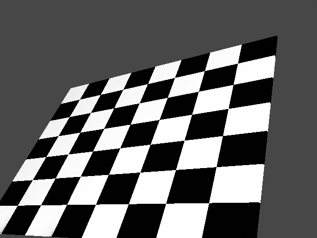

# Camera instrinsics verification



Generate calibration images to verify that the way we set the camera intrinsics is correct.

## Usage

Execute in the BlenderProc main directory:

```
python run.py examples/calibration/config.yaml
``` 

## Calibration

After rendering we can use the images to estimate the actual K matrix using opencv

```
python examples/calibration/calibrate.py
```

This should now output something like:

```
Chessboard found in 62 of 82 images
Camera matrix : 

[[549.94532675   0.         519.75156197]
 [  0.         399.84985521 339.58950562]
 [  0.           0.           1.        ]]

Mean error:  0.04055031146662476
```

## Steps

* Loads chessboard: `loader.ObjectLoader` module.
* Creates a point light : `lighting.LightLoader` module.
* Set camera to origin and set intrinsics: `camera.CameraLoader` module.
* Sample poses of chess board: `object.CalibrationboardSampler` module.
* Renders rgb: `renderer.RgbRenderer` module plus normals.

## Config file

### Camera loader

```yaml
  {
    "module": "camera.CameraLoader",
    "config": {
      "cam_poses": [{
        "location": [0,0,0],
        "rotation_euler": [0,0,0]
      }],
      "intrinsics": {
        "resolution_x": 640,
        "resolution_y": 480,
        "cam_K": [ 550.,   0., 519.5,
                   0., 400., 339.5,
                   0.,   0.,   1. ],
      }
    }
  }
```

Here we set the camera intrinsics, specifically the K matrix and the image resolution are set.
If everything works fine, the K matrix should be identical to the one estimated by opencv based on the renderings.
Additionally, we set all location and rotation parameters to zero.

### Calibrationboard Sampler

```yaml
  {
    "module": "object.CalibrationboardSampler",
    "config": {
      "board_name": "Cube",
      "rot_sampler": {
        "provider": "sampler.Uniform3d",
        "max": [-0.7,-0.7,-0.7],
        "min": [0.7,0.7,0.7]
      },
      "corner_coords": [
           [-0.429058, -0.286038, 0.004883],
           [0.429058, -0.286038, 0.004883],
           [0.429058, 0.429058, 0.004883],
           [-0.429058, 0.429058, 0.004883]
      ]
    }
  }
```

This module samples the configured chess board across the camera view. 
We only have to specificy the name of the calibration board, then how rotations should be sampled and the local coordinates of points that should always be in the camera view.
In this example we use the outer internal corners of our chess board.
