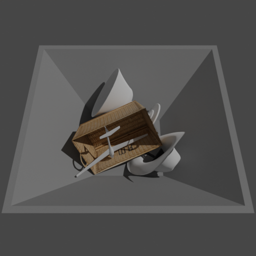

# Convex decomposition for generating stable and exact collision shapes



When running physical simulations in blender, the choice of the correct collision shapes is crucial to achieve stable results.
While using the `CONVEX_HULL` collision shape results in very stable simulations, the result might look very implausible for non-convex objects (e.q. objects floating).
The `MESH` collision shape allows for more exact collisions, however the simulation also gets very unstable and objects can glitch through each other.

`CONVEX_DECOMPOSITION` is a compromise between both: 
The [V-HACD algorithm](https://github.com/kmammou/v-hacd) is used to decompose a given non-convex object into multiple approximate convex parts.
The union of these parts can then be used as an exact and stable collision shape for the object.

In this example we load a bin and some highly non-convex shapenet objects, apply convex decomposition to generate collision shapes and then let the objects drop into the bin. 

## Usage

Execute in the BlenderProc main directory:

```
python run.py examples/physics_convex_decomposition/config.yaml examples/physics_convex_decomposition/bin.obj <PATH_TO_ShapeNetCore.v2> examples/physics_convex_decomposition/output
```

* `examples/physics_convex_decomposition/config.yaml`: path to the configuration file with pipeline configuration.
* `examples/physics_convex_decomposition/bin.obj`: path to the object file containing the bin
* `<PATH_TO_ShapeNetCore.v2>`: path to the downloaded shape net core v2 dataset, get it [here](http://www.shapenet.org/)
* `examples/physics_convex_decomposition/output`: path to the output directory.

## Visualization

Visualize the generated data:

```
python scripts/visHdf5Files.py examples/physics_convex_decomposition/output/0.hdf5
```

## Steps

* Loads `examples/physics_convex_decomposition/bin.obj` with `"physics" = False`: `loader.ObjectLoader` module.
* Loads 5 shapenet objects with `"physics" = True`
* Randomly places the shapenet objects above the bin: `object.ObjectPoseSampler` module.
* Adds a camera and a light: `camera.CameraLoader` and `lighting.LightLoader` module.
* Runs the physics simulation: `object.PhysicsPositioning` module.
* Renders rgb and distance: `renderer.RgbRenderer` module.

## Config File

### Run simulation

```yaml
{
  "module": "object.PhysicsPositioning",
  "config": {
    "min_simulation_time": 4,
    "max_simulation_time": 20,
    "check_object_interval": 1,
    "collision_shape": "CONVEX_DECOMPOSITION"
  }
}
```

We apply physics position in the same way as in the basic `pyhsics_positioning` example.
However, this time we use `CONVEX_DECOMPOSITION` as collision shape, which will result in the following extra steps:
* In the first run, BlenderProc will automatically download and build V-HACD into `external/vhacd/v-hacd` (we only support linux here at the moment)
* For each object, V-HACD is called to do the actual convex decomposition (this may take a while)
* The approximate convex parts are placed as children to the original objects in the scene graph
* The convex parts are hidden during rendering and are provided with `CONVEX_HULL` collision shapes
* The collision shape of their parent / the original objects is set to `COMPOUND` and will therefore consist of the UNION of their children's collision shapes
* The result of the convex decomposition of each object is cached in `resources/decomposition_cache` (key is a hash based on the object's local vertex coordinates). Therefore, running the example a second time will be a lot faster.